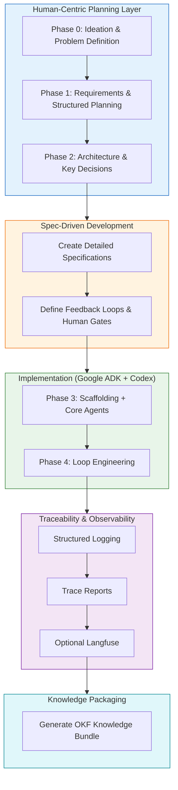

# fhir-query-validator-factory

> **Demonstration repository** showcasing how to apply **Software Factory** principles when building agentic systems using Google ADK.

**In a nutshell**: This project shows a disciplined, spec-driven way to build observable and governable agentic AI systems — with explicit feedback loops, human oversight, and strong traceability.

---

## Environment Setup

**Requirements:** Python 3.11+

Dependencies are declared in [`pyproject.toml`](pyproject.toml). You can use **[uv](https://docs.astral.sh/uv/)** (recommended) or plain `pip` — both work; `uv` is not required.

### Option A: uv (recommended)

```bash
# Install uv if needed: https://docs.astral.sh/uv/getting-started/installation/

uv venv
source .venv/bin/activate   # Windows: .venv\Scripts\activate

uv pip install -e ".[dev]"  # core + pytest + ruff
# Optional extras:
# uv pip install -e ".[dev,adk-cli,observability]"
```

### Option B: pip

```bash
python3 -m venv .venv
source .venv/bin/activate

pip install -e ".[dev]"
```

### Secrets and server configuration

Copy the example env file and add any API keys locally (never commit `.env.local`):

```bash
cp .env.example .env.local
```

| Variable | Purpose |
|----------|---------|
| `FHIR_DEFAULT_SERVER_KEY` | Default server (`hapi`, `firely`, `spark`, `wildfhir`, `mockhealth`) |
| `MOCK_HEALTH_API_KEY` | Bearer API key for [mock.health](https://mock.health/docs) (`server_key: mockhealth`) |

`python-dotenv` loads `.env.local` automatically at startup. See [Configuration](docs/configuration.md) and [Public Test Servers](docs/public-test-servers.md).

---

## Quick Start

### Run the Demos

```bash
# Feedback loops (public HAPI server)
python3 scripts/demo_loops.py

# Structured agent traceability reports
python3 scripts/demo_traceability.py
```

### mock.health (authenticated sandbox)

With `MOCK_HEALTH_API_KEY` set in `.env.local`:

```bash
python3 -c "
from src.agentic_layer.graph.validation_workflow import run_validation_workflow
r = run_validation_workflow({
    'query_url': 'Patient?_count=1',
    'server_key': 'mockhealth',
    'mode': 'validate_and_execute',
})
print(r['final_output'])
"
```

### Explore with Jupyter Notebook

```bash
jupyter notebook examples/notebooks/demo_loops.ipynb
```

The notebook includes public server switching, mock.health (when the API key is set), and human-escalation scenarios.

### Run tests

```bash
python3 -m pytest tests/ -q
```

### Key Documentation

| Document                        | Purpose                                      |
|--------------------------------|----------------------------------------------|
| [Process Overview](docs/process-overview.md) | End-to-end methodology (with Mermaid diagram) |
| [Architecture](docs/architecture.md)         | System design and specialist agents          |
| [Loop Engineering](docs/loop-engineering.md) | Explanation of feedback loops                |
| [Traceability](docs/traceability.md)         | How to observe agent decisions               |
| [Configuration](docs/configuration.md)       | How to configure servers and authentication  |
| [Public Test Servers](docs/public-test-servers.md) | Server catalog including mock.health   |
| [Specifications](docs/spec/)                 | Detailed behavior specs for each agent       |
| [Implementation Review](docs/reviews/spec-implementation-compliance-review.md) | E2E demo + compliance report |
| [Spec vs Code Gap Review](#spec-vs-code-gap-review) | Implementation alignment summary |

---

## What is This Project?

This repository demonstrates a **modern Software Factory approach** for developing agentic AI systems. It evolves the ideas from the original [fhirqueryvalidator](https://github.com/yogesh-parte/fhirqueryvalidator) into a more intelligent, generalized, and observable system.

Instead of building agents in an ad-hoc way, this project follows a structured process:
- Clear upfront planning and specifications
- Specialist agents with narrow responsibilities
- Explicit feedback loops (including learning and human escalation)
- Strong emphasis on traceability and governance

The result is a working demonstration of a **generalized FHIR query validator** that can validate any parameter from a CapabilityStatement, execute queries, detect repeated user errors, and respond intelligently.

---

## Methodology / Process Overview



**Core Principles**:
- Planning is the highest-leverage activity
- Spec-Driven Development before coding
- Specialist Agents + Explicit Feedback Loops
- Human Oversight at critical points
- Traceability & Observability by design

---

## Project Goals

- Demonstrate a **repeatable pattern** for building agentic systems
- Show the value of **explicit loop engineering**
- Maintain **human governance** in agentic workflows
- Provide strong **traceability** and observability
- Create reusable documentation and specifications

---

## Technology

- **Primary**: Google Agent Development Kit (ADK) + `agents-cli`
- **Language**: Python
- **Optional Observability**: Langfuse

---

## Repository Knowledge

This project follows a **documentation-first** approach. We recommend using the [OKF skill](https://github.com/YPCC/grok-custom-skills) to generate a structured knowledge bundle from this repository:

```bash
okf generate --repo . --output docs/knowledge-bundle.md
```

---

## Project Structure

```
docs/           → Specifications, architecture, and guides
planning/       → Detailed phase-by-phase planning artifacts
src/agentic_layer/ → All agents and the main workflow
scripts/        → Demo scripts (loops + traceability)
tests/          → Unit, regression, and integration tests
```

---

## Spec vs Code Gap Review

*Review date: 2026-06-30. Compares `docs/spec/*.md` against `src/agentic_layer/` implementation.*

### Verdict

The implementation now **meets the core acceptance criteria** across all five agent specs. The workflow is orchestrated as a **Google ADK 2.0 graph** (`root_agent` in `fhir_validator_agent/agent.py`) with a shared engine in `workflow_engine.py`, while `run_validation_workflow()` remains available for demos and tests.

Real HTTP I/O, auth forwarding, CapabilityStatement-driven validation, tiered escalation, and the spec output contract are implemented. **41 tests** cover unit, integration, and regression paths.

**Remaining gaps:** 0 critical bugs; a small number of production-hardening and documentation items (see [Remaining open items](#remaining-open-items)).

### Spec acceptance criteria status

| Spec | Acceptance criteria (summary) | Implementation status |
|------|------------------------------|------------------------|
| [query-validation-spec](docs/spec/query-validation-spec.md) | Multi-server config, auth, full CapabilityStatement validation, cross-server patterns, auth errors | **Closed** — dynamic validation via `query_parser` + `interpreted_capability`; auth errors; unknown `server_key` raises |
| [cache-agent-spec](docs/spec/cache-agent-spec.md) | Auth-aware fetch, hybrid invalidation, decision logging | **Closed** — Bearer/OAuth headers, auth-scoped keys, TTL + ETag/304, miss/hit/refresh logging |
| [query-execution-spec](docs/spec/query-execution-spec.md) | Real execution, auth headers, structured responses, timing | **Closed** — `httpx` execution with auth, structured errors, `elapsed_ms` |
| [rule-and-learner-spec](docs/spec/rule-and-learner-spec.md) | Pattern detection, learner vs human escalation, CapabilityStatement-based guidance, audit | **Closed** — tiered thresholds, audit log, capability-aware learner guidance |
| [human-intervention-spec](docs/spec/human-intervention-spec.md) | Triggers, pause/notify/review/resume, audit, severity | **Closed** — pause gate, review/resume API, severity classification, audit records |

### What is implemented

- **ADK graph workflow** — `Workflow` with `@node` functions: initialize → pipeline → finalize (`validation_workflow.py`)
- **ADK / agents-cli entry point** — `fhir_validator_agent/agent.py` (`adk run`, `adk web`)
- **CapabilityStatement validation** — resource types, search params, modifiers, comparators, chained params
- **Auth** — Bearer + OAuth2 client credentials (`authlib`); per-server API keys (e.g. `MOCK_HEALTH_API_KEY` for `mockhealth`); headers on cache and execution
- **mock.health** — authenticated FHIR sandbox at `https://api.mock.health/fhir` (`server_key: mockhealth`)
- **Cache** — hybrid TTL + conditional ETag/304; auth-scoped keys; admin invalidation via `FHIR_CACHE_INVALIDATE` / `FHIR_CACHE_INVALIDATE_KEYS`
- **Escalation** — learner at 3+ failures / 10 min; human at 5+ failures / 15 min or high-severity; structured audit log
- **Human gate** — pause, notify (demo channel), review decision, resume; severity levels
- **Output contract** — `{valid, server_used, errors, warnings, executed, results}` in `final_output`
- **Tests** — auth, cache, execution, validation, rule/learner, human gate, ADK workflow, integration paths

### Resolved critical gaps (2026-06-30)

| Area | Was | Now |
|------|-----|-----|
| **Validation** | Hard-coded substring checks | Parses `query_url` against `interpreted_capability` |
| **HTTP I/O** | Simulated responses | Real `httpx` metadata + search requests |
| **Auth** | Env vars unused | Bearer/OAuth via `auth/provider.py`, forwarded on all HTTP |
| **Cache** | TTL only | TTL + ETag/304 + auth-scoped keys |
| **Escalation** | Always `"learner"` | Learner and human paths with audit reasoning |
| **Output** | Non-spec shape | Matches query-validation-spec JSON schema |
| **Orchestration** | ADK-style stub | Google ADK 2.0 `Workflow` graph |

### Threshold reconciliation (code)

Code implements reconciled thresholds from the specs (README priority fix #4):

| Path | Threshold | Source spec |
|------|-----------|-------------|
| Learner escalation | 3+ invalid queries within **10 minutes** | `rule-and-learner-spec.md` |
| Human escalation | 5+ invalid queries within **15 minutes** (or high-severity) | `human-intervention-spec.md` |

Pattern history is keyed by **`user_id` + `server_key`**.

### Remaining open items

These are **non-blocking** for the demo; they are production or documentation follow-ups:

| Sev | Area | Item |
|-----|------|------|
| docs | `loop-engineering.md` | Still references 5-minute threshold; should be updated to match code (10 min / 15 min) |
| docs | Demos / Makefile | `demo_loops.py` and notebook cover multi-server + mock.health; `Makefile` targets still stubs |
| suggestion | Human gate | Notification is stdout-based; production needs email/ticket/dashboard integration |
| suggestion | OAuth | Client credentials supported; authorization-code / PKCE / token rotation not implemented |
| suggestion | Cache | In-memory only; Redis or distributed cache not wired |
| suggestion | Learner | Per-user guidance only; global rule updates from learner not implemented (spec open question) |
| suggestion | Deployment | ADK graph is runnable locally; Agent Engine / Cloud Run deployment is documented but not automated in-repo |

### Resolved issues by spec (formerly open)

<details>
<summary>query-validation-spec — all former bugs closed</summary>

- CapabilityStatement-driven validation in `query_validator.py`
- Modifiers/comparators in `capability_interpreter.py`
- `auth_token` in workflow state; spec `final_output` schema
- Unknown `server_key` raises `UnknownServerKeyError`
- OAuth/Bearer used via `auth/provider.py` and `get_auth_headers()`
- Real HTTP CapabilityStatement fetch in `cache_agent.py`
- Pattern history keyed by `user_id` + `server_key`
</details>

<details>
<summary>cache-agent-spec — all former bugs closed</summary>

- `Authorization` header on fetch; auth-scoped cache keys
- Conditional ETag/304 requests within TTL
- `invalidate()` honors `FHIR_CACHE_INVALIDATE` env signals
- Cache decision logging (miss, hit, 304, refresh, expire)
</details>

<details>
<summary>query-execution-spec — all former bugs closed</summary>

- Real FHIR HTTP execution; auth header forwarding
- `auth_token` passed through workflow; `elapsed_ms` timing
- Tests in `test_query_execution.py`
</details>

<details>
<summary>rule-and-learner-spec — all former bugs closed</summary>

- Tiered learner vs human escalation in `rule_agent.py`
- Reconciled 10 min / 15 min thresholds; typed `error_type` tracking
- CapabilityStatement-based guidance in `search_learner_agent.py`
- Structured audit log with reasoning
- Tests in `test_rule_agent.py`, `test_search_learner.py`
</details>

<details>
<summary>human-intervention-spec — all former bugs closed</summary>

- Human branch live in workflow; pause/notify/review/resume in `human_gate.py`
- Persistent audit records; severity classification
- Tests in `test_human_gate.py`; integration human-escalation path
</details>

<details>
<summary>configuration and tests — former bugs closed</summary>

- Protected server registration via `FHIR_USE_AUTH` + `FHIR_SERVER_BASE`
- Integration tests: valid query, human escalation, unknown server key
- Cache tests: expiry, auth-scoped keys, 304, invalidation
</details>

---

## Status

This is a living demonstration project. It is intended as a **reference example** of how to apply Software Factory principles to modern agentic AI development.

The [Spec vs Code Gap Review](#spec-vs-code-gap-review) above tracks alignment between specifications and the current implementation. Core spec acceptance criteria are **closed** as of 2026-06-30; remaining items are production-hardening and doc updates.

Feedback and contributions are welcome.

---

*Built with strong emphasis on planning, specifications, feedback loops, and observability.*
