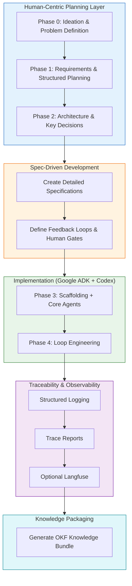

# fhir-query-validator-factory

> **Demonstration repository** showcasing how to apply **Software Factory** principles when building agentic systems using Google ADK.

**In a nutshell**: This project shows a disciplined, spec-driven way to build observable and governable agentic AI systems — with explicit feedback loops, human oversight, and strong traceability.

---

## Quick Start

### Run the Demos

```bash
# See feedback loops in action
python scripts/demo_loops.py

# See structured agent traceability reports
python scripts/demo_traceability.py
```

### Explore with Jupyter Notebook

```bash
jupyter notebook examples/notebooks/demo_loops.ipynb
```

### Key Documentation

| Document                        | Purpose                                      |
|--------------------------------|----------------------------------------------|
| [Process Overview](docs/process-overview.md) | End-to-end methodology (with Mermaid diagram) |
| [Architecture](docs/architecture.md)         | System design and specialist agents          |
| [Loop Engineering](docs/loop-engineering.md) | Explanation of feedback loops                |
| [Traceability](docs/traceability.md)         | How to observe agent decisions               |
| [Configuration](docs/configuration.md)       | How to configure servers and authentication  |
| [Specifications](docs/spec/)                 | Detailed behavior specs for each agent       |

---

## What is This Project?

This repository demonstrates a **modern Software Factory approach** for developing agentic AI systems. It evolves the ideas from the original [fhirqueryvalidator](https://github.com/yogesh-parte/fhirqueryvalidator) into a more intelligent, generalized, and observable system.

Instead of building agents in an ad-hoc way, this project follows a structured process:
- Clear upfront planning and specifications
- Specialist agents with narrow responsibilities
- Explicit feedback loops (including learning and human escalation)
- Strong emphasis on traceability and governance

The result is a working demonstration of a **generalized FHIR query validator** that can validate any parameter from a CapabilityStatement, execute queries, detect repeated user errors, and respond intelligently.

---

## Methodology / Process Overview



**Core Principles**:
- Planning is the highest-leverage activity
- Spec-Driven Development before coding
- Specialist Agents + Explicit Feedback Loops
- Human Oversight at critical points
- Traceability & Observability by design

---

## Project Goals

- Demonstrate a **repeatable pattern** for building agentic systems
- Show the value of **explicit loop engineering**
- Maintain **human governance** in agentic workflows
- Provide strong **traceability** and observability
- Create reusable documentation and specifications

---

## Technology

- **Primary**: Google Agent Development Kit (ADK) + `agents-cli`
- **Language**: Python
- **Optional Observability**: Langfuse

---

## Repository Knowledge

This project follows a **documentation-first** approach. We recommend using the [OKF skill](https://github.com/YPCC/grok-custom-skills) to generate a structured knowledge bundle from this repository:

```bash
okf generate --repo . --output docs/knowledge-bundle.md
```

---

## Project Structure

```
docs/           → Specifications, architecture, and guides
planning/       → Detailed phase-by-phase planning artifacts
src/agentic_layer/ → All agents and the main workflow
scripts/        → Demo scripts (loops + traceability)
tests/          → Unit, regression, and integration tests
```

---

## Status

This is a living demonstration project. It is intended as a **reference example** of how to apply Software Factory principles to modern agentic AI development.

Feedback and contributions are welcome.

---

*Built with strong emphasis on planning, specifications, feedback loops, and observability.*
