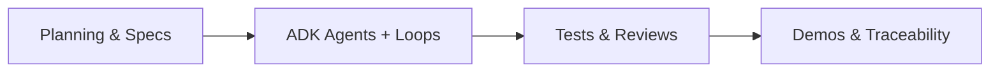

# fhir-query-validator-factory

Demonstration repository for building **agentic FHIR query validation** with [Software Factory](docs/process-overview.md) principles — spec-driven development, specialist agents, feedback loops, human oversight, and traceability. Orchestrated with **Google ADK 2.0**.

**Status (2026-06-30):** Phases 0–5 complete. All five agent specs meet core acceptance criteria. **148 tests** passing (~99% unit coverage on `src/agentic_layer`).

---

## Quick start

**Requirements:** Python 3.11+

```bash
python3 -m venv .venv && source .venv/bin/activate
pip install -e ".[dev]"
cp .env.example .env.local   # add MOCK_HEALTH_API_KEY if using mock.health
```

### Run a demo

All demos make **live HTTP requests** to FHIR servers.

| Command | What it shows |
|---------|---------------|
| `make demo-loops` | HAPI — cache → validate → execute → learner escalation |
| `make demo-agent-trace` | Per-agent pipeline, audit trail, human pause → resume |
| `make demo-mockhealth` | Authenticated mock.health loops (needs `.env.local`) |
| `make demo-adk-cli` | Google ADK CLI (`adk run`) scenarios |
| `make demo-adk-web` | Google ADK Web UI + API |
| `make test` | Full test suite |
| `make security` | Bandit + pip-audit |

See [`scripts/`](scripts/) for all demo scripts. ADK entry point: [`fhir_validator_agent/agent.py`](fhir_validator_agent/agent.py) (`adk run`, `adk web`).

**No API key (public servers):**

```bash
python3 scripts/demo_loops.py
python3 scripts/demo_agent_traceability.py --server firely
```

**mock.health** — set `MOCK_HEALTH_API_KEY` in `.env.local`, then `make demo-mockhealth`.

### Run tests

```bash
python3 -m pytest tests/ -q
```

---

## What it does

A generalized FHIR search query validator that:

1. Fetches and caches each server's **CapabilityStatement**
2. **Validates** `query_url` against supported resources and search parameters
3. **Executes** valid queries (optional)
4. Detects **repeated invalid patterns** and escalates to a learner or human reviewer
5. Returns a structured **`final_output`** contract and audit trail

Escalation thresholds: learner at **3+** failures / 10 min; human at **5+** failures / 15 min (or high-severity).

---

## Project structure

```
src/agentic_layer/     Agents, workflow engine, auth, config
fhir_validator_agent/  ADK root_agent (adk run / adk web)
scripts/               Demo scripts + _demo_utils.py
tests/                 Unit, integration, regression (148 tests)
docs/                  Specs, architecture, guides, reviews
planning/              Phase 0–5 roadmap (see planning/README.md)
examples/notebooks/    Jupyter demo (demo_loops.ipynb)
```

---

## Documentation

| Topic | Link |
|-------|------|
| Process & methodology | [docs/process-overview.md](docs/process-overview.md) |
| Architecture | [docs/architecture.md](docs/architecture.md) |
| Feedback loops | [docs/loop-engineering.md](docs/loop-engineering.md) |
| Traceability | [docs/traceability.md](docs/traceability.md) |
| Configuration & secrets | [docs/configuration.md](docs/configuration.md) · [.env.example](.env.example) |
| Public test servers | [docs/public-test-servers.md](docs/public-test-servers.md) |
| Agent specifications | [docs/spec/](docs/spec/) |
| Planning roadmap | [planning/README.md](planning/README.md) |

### Reviews

Detailed audit reports live in `docs/reviews/` — not duplicated here.

| Review | Summary |
|--------|---------|
| [Spec compliance](docs/reviews/spec-implementation-compliance-review.md) | Implementation vs `docs/spec/*.md` |
| [OWASP security](docs/reviews/owasp-security-review.md) | Pass 1 → hardening → Pass 2 (2026-06-30) |

**Spec verdict:** all five agent specs — **closed** for core acceptance criteria.

**Security verdict:** acceptable for **local demos** by default; enable `FHIR_*` production flags (see `.env.example`) before networked ADK Web deployment. Threat model in [`fhir_validator_agent/agent.py`](fhir_validator_agent/agent.py).

---

## Methodology



Phases 0–5 are documented in [`planning/`](planning/). Core principles: spec before code, specialist agents, explicit loops, human gates, observable decisions.

---

## Technology

- **Google ADK 2.0** — graph workflow (`Workflow` + shared `execute_workflow()`)
- **Python 3.11+** — `httpx`, `authlib`, `pydantic`
- **Optional** — Langfuse observability, `agents-cli`

---

## TODO

Non-blocking follow-ups tracked here; see [Phase 5](planning/phase-5-demo-hardening-and-governance.md) for detail.

| Priority | Item |
|----------|------|
| P2 | Notebook parity — add mock.health and human-gate cells to match CLI demos |
| P2 | Align `docs/loop-engineering.md` with code (ETag/304, 10m/15m thresholds) |
| P2 | Commit reproducible lockfile (`uv.lock` or `requirements.lock`) |
| P3 | `follow_redirects=False` on `CacheAgent` metadata fetch |
| suggestion | Human-gate notification beyond stdout (email/ticket/dashboard) |
| suggestion | Distributed cache (Redis); Langfuse enabled in a demo path |
| suggestion | OAuth authorization-code / PKCE; token rotation |
| suggestion | ADK deployment automation (Agent Engine / Cloud Run) |
| suggestion | Refresh OKF knowledge bundle (`docs/knowledge-bundle.md`) |

---

## Contributing

This is a living reference demo. Feedback and contributions are welcome.

*Built with emphasis on planning, specifications, feedback loops, and observability.*