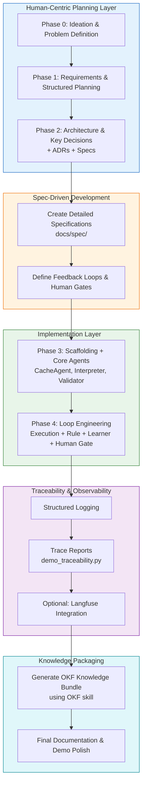

# Process Overview: Software Factory for Agentic Systems

This document provides a high-level view of the methodology followed in building the `fhir-query-validator-factory` demonstration.

## Mermaid Diagram: End-to-End Process

## Process Summary

| Layer                        | Focus                              | Key Activities                              | Artifacts Produced                     |
|-----------------------------|------------------------------------|---------------------------------------------|----------------------------------------|
| **Human Planning**          | Upstream thinking                  | Ideation, Requirements, Architecture        | Planning files, ADRs, Specs            |
| **Spec-Driven Development** | Define behavior before code        | Write detailed agent specifications         | `docs/spec/*.md`                       |
| **Implementation**          | Build using ADK + Codex            | Develop specialist agents + workflow        | `src/agentic_layer/`                   |
| **Loop Engineering**        | Design feedback mechanisms         | Cache, Execution, Pattern → Learner/Human   | `docs/loop-engineering.md`             |
| **Observability**           | Make decisions visible             | Structured traces, optional Langfuse        | `scripts/demo_traceability.py`         |
| **Knowledge Packaging**     | Make knowledge reusable            | Generate OKF bundle                         | Structured knowledge documentation     |

## Core Principles Followed

- **Planning is the highest-leverage activity**
- **Spec-Driven Development** before implementation
- **Specialist Agents** over monolithic agents
- **Explicit Feedback Loops** (including meta-learning)
- **Human Oversight** at critical points
- **Traceability & Observability** by design
- **Knowledge as a first-class deliverable** (via OKF)

This process can be reused as a template for building other agentic systems in a disciplined, governable way.
