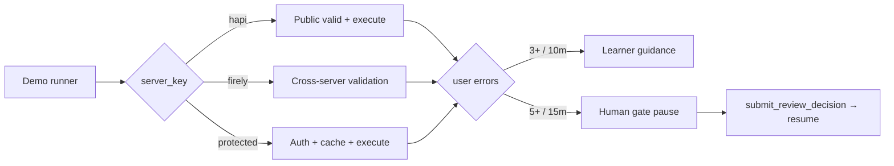

# Spec Implementation Compliance Review

| Field | Value |
|-------|-------|
| **Review timestamp** | `2026-06-30T04:12:00+05:30` (IST) / `2026-06-29T22:42:00Z` (UTC) |
| **Reviewer** | Automated compliance review (goal-driven analysis) |
| **Scope** | `docs/spec/*.md` vs `src/agentic_layer/`, `fhir_validator_agent/`, `scripts/`, `tests/`, `examples/`, `planning/`, supporting `docs/*.md` |
| **Evidence runs** | `demo_loops.py` (exit 0), `demo_traceability.py` (exit 0), `pytest` (38 passed) — captured in scratch dir `{SCRATCH}/` |
| **Related** | [README Spec vs Code Gap Review](../README.md#spec-vs-code-gap-review) (summary); this report focuses on **E2E demonstration coverage**, **tooling**, and **SPEC/doc update call-outs** |

---

## Executive summary

The **implementation layer** (`src/agentic_layer/`) is substantially aligned with all five draft specifications: real HTTP via `httpx`, CapabilityStatement-driven validation, auth forwarding, hybrid cache invalidation, tiered escalation, and a human intervention gate are present and tested.

The **end-to-end demonstration layer** (`scripts/`, `examples/notebooks/`, `Makefile`) does **not yet exercise the full SPEC surface area**. Demos hard-code `server_key: "hapi"`, never show protected-server auth, never reach the human-escalation path, and do not switch across Firely/Spark/WildFHIR. Interactive ADK entry points exist but are not wired into demo scripts.

**Verdict:**

| Layer | Status | Notes |
|-------|--------|-------|
| Spec acceptance criteria (code) | **Mostly compliant** | 5/5 specs have implementing modules; minor gaps in production hardening |
| E2E demonstration as per SPEC | **Partially compliant** | Core happy path + learner loop demonstrated; multi-server, auth, human gate not demonstrated |
| Documentation consistency | **Needs updates** | Threshold mismatch in `loop-engineering.md`; missing `public-test-servers.md`; stale `planning/` status |

---

## Review methodology

1. Read all five specification files in [`docs/spec/`](../spec/) and supporting architecture/configuration/loop docs.
2. Traced each spec acceptance criterion to implementing modules under [`src/agentic_layer/`](../../src/agentic_layer/).
3. Ran live demos and test suite (see [Evidence: demo and test runs](#evidence-demo-and-test-runs)).
4. Compared demo scripts and notebook against SPEC-required behaviors (multi-server, auth, escalation paths, output contract).
5. Identified SPEC and doc inconsistencies requiring updates (draft status, open questions, cross-doc threshold conflicts).

---

## Per-spec compliance

All specs are marked **Draft** with open questions. Compliance below reflects **current on-disk implementation**, not frozen production requirements.

### 1. [query-validation-spec.md](../spec/query-validation-spec.md)

| Acceptance criterion | Status | Implementation | Gap / note |
|---------------------|--------|----------------|------------|
| Supports switching between multiple public test servers via configuration | ✅ Met | [`settings.py`](../../src/agentic_layer/config/settings.py) — `hapi`, `firely`, `spark`, `wildfhir` in `DEFAULT_SERVERS` | Demos never switch servers; no integration test against live alternate servers |
| Can authenticate against protected servers using Bearer token or OAuth | ✅ Met | [`auth/provider.py`](../../src/agentic_layer/auth/provider.py), [`workflow_engine.py`](../../src/agentic_layer/graph/workflow_engine.py) | OAuth is client-credentials only; no demo scenario |
| Validates any parameter declared in the CapabilityStatement | ✅ Met | [`query_validator.py`](../../src/agentic_layer/agents/query_validator.py), [`capability_interpreter.py`](../../src/agentic_layer/agents/capability_interpreter.py), [`query_parser.py`](../../src/agentic_layer/utils/query_parser.py) | Modifiers derived from FHIR type tables, not server-declared modifier lists |
| Pattern detection and escalation work across different servers | ⚠️ Partial | Pattern history keyed by `user_id:server_key` in [`query_validator.py`](../../src/agentic_layer/agents/query_validator.py) | No test or demo proving cross-server isolation |
| Clear error messages when authentication fails | ✅ Met | [`workflow_engine.py`](../../src/agentic_layer/graph/workflow_engine.py) lines 88–101; execution 401/403 in [`query_execution.py`](../../src/agentic_layer/agents/query_execution.py) | — |

**Output contract:** [`build_final_output()`](../../src/agentic_layer/graph/workflow_engine.py) returns the six spec fields (`valid`, `server_used`, `errors`, `warnings`, `executed`, `results`) plus demo extensions (`pattern_detected`, `escalation`, `guidance`, `human_review_required`, `human_review`). Core contract is satisfied; extensions are additive.

**Open questions (spec §10):** OAuth flow preference and multi-auth-per-server remain unresolved in code (client-credentials + Bearer implemented).

---

### 2. [cache-agent-spec.md](../spec/cache-agent-spec.md)

| Acceptance criterion | Status | Implementation | Gap / note |
|---------------------|--------|----------------|------------|
| Works with both public and authenticated servers | ✅ Met | [`cache_agent.py`](../../src/agentic_layer/agents/cache_agent.py) — auth headers on fetch | — |
| Correctly implements hybrid invalidation | ✅ Met | TTL (7-day default) + ETag/`If-None-Match` + 304 handling | `Last-Modified` / `If-Modified-Since` not implemented |
| Logs cache decisions (hit/miss/refresh/304) | ✅ Met | stdout logging in `get_capability_statement()` | Structured log sink not wired |
| Respects authentication when fetching from protected servers | ✅ Met | [`auth_cache_suffix()`](../../src/agentic_layer/auth/provider.py) for auth-scoped keys | In-memory cache only; no Redis |

Tests: [`tests/unit/test_cache_agent.py`](../../tests/unit/test_cache_agent.py) — miss/hit, 304, auth headers, auth-scoped keys, invalidation.

---

### 3. [query-execution-spec.md](../spec/query-execution-spec.md)

| Acceptance criterion | Status | Implementation | Gap / note |
|---------------------|--------|----------------|------------|
| Successfully executes queries on public test servers | ✅ Met | Real `httpx` GET in [`query_execution.py`](../../src/agentic_layer/agents/query_execution.py) | Live demo uses HAPI only |
| Correctly passes authentication headers for protected servers | ✅ Met | `get_auth_headers()` forwarded | No live protected-server demo |
| Returns structured success/error responses | ✅ Met | `status`, `error_type`, `http_status`, `elapsed_ms`, bundle metadata | Full Bundle body not returned (summary only) |
| Logs execution outcome and timing | ✅ Met | `print` + `elapsed_ms` in response | — |

Tests: [`tests/unit/test_query_execution.py`](../../tests/unit/test_query_execution.py) (mocked httpx).

---

### 4. [rule-and-learner-spec.md](../spec/rule-and-learner-spec.md)

| Acceptance criterion | Status | Implementation | Gap / note |
|---------------------|--------|----------------|------------|
| Correctly detects repeated invalid patterns per user | ✅ Met | [`query_validator.py`](../../src/agentic_layer/agents/query_validator.py) — `LEARNER_THRESHOLD` 3/10m, `HUMAN_THRESHOLD` 5/15m | — |
| Triggers appropriate escalation path (Learner vs Human) | ✅ Met | [`rule_agent.py`](../../src/agentic_layer/agents/rule_agent.py) — tiered + high-severity | Demos only show learner path |
| Search Learner Agent provides helpful, accurate suggestions | ✅ Met | [`search_learner_agent.py`](../../src/agentic_layer/agents/search_learner_agent.py) — capability-aware | No LLM; rule-based templates |
| Human intervention path clearly defined and observable | ⚠️ Partial | [`human_gate.py`](../../src/agentic_layer/agents/human_gate.py) + workflow branch in [`workflow_engine.py`](../../src/agentic_layer/graph/workflow_engine.py) | Not demonstrated in demo scripts |
| All decisions logged with reasoning | ✅ Met | [`audit_log.py`](../../src/agentic_layer/utils/audit_log.py) via RuleAgent | — |

**ADK graph note:** [`route_escalation`](../../src/agentic_layer/graph/nodes.py) node exists but is **not wired** into [`validation_workflow.py`](../../src/agentic_layer/graph/validation_workflow.py) edges. Escalation runs inside `run_validation_pipeline` synchronously; the routing node is dead code for graph branching.

Tests: [`tests/unit/test_rule_agent.py`](../../tests/unit/test_rule_agent.py), [`tests/unit/test_search_learner.py`](../../tests/unit/test_search_learner.py), human escalation in [`tests/integration/test_full_workflow.py`](../../tests/integration/test_full_workflow.py).

---

### 5. [human-intervention-spec.md](../spec/human-intervention-spec.md)

| Acceptance criterion | Status | Implementation | Gap / note |
|---------------------|--------|----------------|------------|
| Clear, documented conditions for triggering human review | ⚠️ Partial | Code: 5+ failures/15m, high-severity chained params, abuse heuristics in [`rule_agent.py`](../../src/agentic_layer/agents/rule_agent.py) | Spec table lists multiple triggers; not all are coded (e.g. "persistent failure to improve") |
| Defined decision options for humans | ✅ Met | [`human_gate.py`](../../src/agentic_layer/agents/human_gate.py) — six `decision_options` | — |
| All interventions logged with context and rationale | ✅ Met | `AuditLog` + review records | Notification is stdout only |
| System can resume correctly after human decision | ✅ Met | `submit_review_decision()`, `is_paused()` gate in [`workflow_engine.py`](../../src/agentic_layer/graph/workflow_engine.py) | No demo of pause → resolve → resume |
| Supports different severity levels | ✅ Met | `InterventionSeverity` enum in [`human_gate.py`](../../src/agentic_layer/agents/human_gate.py) | — |

Tests: [`tests/unit/test_human_gate.py`](../../tests/unit/test_human_gate.py).

---

## E2E demonstration assessment

### What demos currently cover

| Behavior | Demo script | Observed (live run 2026-06-30) |
|----------|-------------|--------------------------------|
| Cache invalidation loop | [`scripts/demo_loops.py`](../../scripts/demo_loops.py) | ✅ HAPI metadata fetch, conditional refresh |
| Valid query + `validate_and_execute` | `demo_loops.py`, [`scripts/demo_traceability.py`](../../scripts/demo_traceability.py) | ✅ `Patient?gender=male` executes on HAPI |
| Pattern detection → learner | `demo_loops.py` (3× invalid for `user-bob`) | ✅ Escalation `learner`, guidance printed |
| Structured trace report | `demo_traceability.py` | ✅ Timestamped report with validation/escalation fields |
| Human escalation | — | ❌ Not in demo scripts (only in integration test with mocks) |
| Multi-server (`firely`, `spark`, `wildfhir`) | — | ❌ All demos hard-code `"server_key": "hapi"` |
| Protected server / auth | — | ❌ No demo sets `FHIR_USE_AUTH` or `auth_token` |
| `validate_only` mode | — | ❌ Demos default to `validate_and_execute` only |
| ADK interactive (`adk web`) | [`fhir_validator_agent/agent.py`](../../fhir_validator_agent/agent.py) | ⚠️ Entry point exists; not scripted in demos |

**Demo server limitation (confirmed):** [`scripts/demo_loops.py`](../../scripts/demo_loops.py) line 26, [`scripts/demo_traceability.py`](../../scripts/demo_traceability.py) lines 62/76, and [`examples/notebooks/demo_loops.ipynb`](../../examples/notebooks/demo_loops.ipynb) all use `server_key: "hapi"` exclusively.

**Threshold in live demo:** Learner triggers on 3rd invalid attempt for `user-bob` (matches code: 3+ in 10 minutes). Human path requires 5 failures in 15 minutes — not shown in demos.

### Demo vs SPEC feature matrix

| SPEC feature | Code support | Demo coverage |
|--------------|-------------|---------------|
| Multi-server switching | ✅ [`settings.py`](../../src/agentic_layer/config/settings.py) | ❌ |
| Bearer / OAuth auth | ✅ [`auth/provider.py`](../../src/agentic_layer/auth/provider.py) | ❌ |
| CapabilityStatement validation | ✅ Full pipeline | ✅ (via live HAPI metadata) |
| Query execution | ✅ [`query_execution.py`](../../src/agentic_layer/agents/query_execution.py) | ✅ HAPI only |
| Learner escalation | ✅ | ✅ `demo_loops.py` |
| Human escalation + pause/resume | ✅ | ❌ |
| Spec `final_output` JSON | ✅ [`build_final_output()`](../../src/agentic_layer/graph/workflow_engine.py) | ✅ (with extensions) |
| ADK graph workflow | ✅ [`validation_workflow.py`](../../src/agentic_layer/graph/validation_workflow.py) | ❌ (linear demo uses `run_validation_workflow`) |

---

## Test coverage vs SPEC compliance

**Run:** `python3 -m pytest tests/ --tb=no -q` → **38 passed** in 0.49s (2026-06-30).

| Test file | SPEC areas exercised | Live network |
|-----------|---------------------|--------------|
| [`tests/unit/test_cache_agent.py`](../../tests/unit/test_cache_agent.py) | Cache-agent-spec | Mocked httpx |
| [`tests/unit/test_capability_interpreter.py`](../../tests/unit/test_capability_interpreter.py) | Query-validation (interpretation) | No |
| [`tests/unit/test_query_validator.py`](../../tests/unit/test_query_validator.py) | Validation, pattern detection | No |
| [`tests/unit/test_query_parser.py`](../../tests/unit/test_query_parser.py) | Query parsing | No |
| [`tests/unit/test_query_execution.py`](../../tests/unit/test_query_execution.py) | Query-execution-spec | Mocked httpx |
| [`tests/unit/test_rule_agent.py`](../../tests/unit/test_rule_agent.py) | Rule-and-learner-spec | No |
| [`tests/unit/test_search_learner.py`](../../tests/unit/test_search_learner.py) | Learner guidance | No |
| [`tests/unit/test_human_gate.py`](../../tests/unit/test_human_gate.py) | Human-intervention-spec | No |
| [`tests/unit/test_settings_auth.py`](../../tests/unit/test_settings_auth.py) | Configuration, protected server | No |
| [`tests/unit/test_auth_provider.py`](../../tests/unit/test_auth_provider.py) | Auth provider | No |
| [`tests/unit/test_adk_workflow.py`](../../tests/unit/test_adk_workflow.py) | ADK graph structure | No |
| [`tests/integration/test_full_workflow.py`](../../tests/integration/test_full_workflow.py) | Full pipeline, human escalation, unknown server | Mocked cache/execute; unknown server is structural |
| [`tests/regression/test_validation_regression.py`](../../tests/regression/test_validation_regression.py) | Regression guard | No |

**Coverage gaps for SPEC-complete demonstration:**

- No live-network test against `firely` / `spark` / `wildfhir`
- No integration test for OAuth token refresh against a real token endpoint
- No end-to-end demo test asserting human pause blocks subsequent requests
- [`Makefile`](../../Makefile) `test` and `demo` targets are placeholders (do not run pytest or demos)

---

## Gaps summary

### Implementation gaps (non-blocking for demo)

| ID | Severity | Area | Description | File(s) |
|----|----------|------|-------------|---------|
| G-01 | suggestion | Cache | In-memory only; no distributed cache | [`cache_agent.py`](../../src/agentic_layer/agents/cache_agent.py) |
| G-02 | suggestion | Cache | No `Last-Modified` conditional requests | [`cache_agent.py`](../../src/agentic_layer/agents/cache_agent.py) |
| G-03 | suggestion | Auth | OAuth client-credentials only; no auth-code/PKCE | [`auth/provider.py`](../../src/agentic_layer/auth/provider.py) |
| G-04 | suggestion | Execution | Returns bundle summary, not full FHIR Bundle | [`query_execution.py`](../../src/agentic_layer/agents/query_execution.py) |
| G-05 | suggestion | ADK graph | `route_escalation` node unused in graph edges | [`nodes.py`](../../src/agentic_layer/graph/nodes.py), [`validation_workflow.py`](../../src/agentic_layer/graph/validation_workflow.py) |
| G-06 | suggestion | Human gate | Notification via stdout; no email/ticket | [`human_gate.py`](../../src/agentic_layer/agents/human_gate.py) |
| G-07 | suggestion | Learner | Per-user guidance only; no global rule updates | [`search_learner_agent.py`](../../src/agentic_layer/agents/search_learner_agent.py) |

### E2E demonstration gaps (blocking "as per SPEC" showcase)

| ID | Severity | Area | Description | File(s) |
|----|----------|------|-------------|---------|
| D-01 | **high** | Demos | All demos use `hapi` only | [`demo_loops.py`](../../scripts/demo_loops.py), [`demo_traceability.py`](../../scripts/demo_traceability.py), [`demo_loops.ipynb`](../../examples/notebooks/demo_loops.ipynb) |
| D-02 | **high** | Demos | No protected-server / auth scenario | scripts, notebook |
| D-03 | **high** | Demos | Human escalation path not demonstrated | scripts (integration test covers with mocks) |
| D-04 | medium | Demos | No `validate_only` scenario | scripts |
| D-05 | medium | Tooling | `Makefile` demo/test targets are stubs | [`Makefile`](../../Makefile) |
| D-06 | medium | Tooling | `make demo` uses `python -m validation_workflow` (not `demo_loops.py`) | [`Makefile`](../../Makefile) |
| D-07 | low | ADK | `adk web` / `agents-cli` not documented in demo flow | [`fhir_validator_agent/agent.py`](../../fhir_validator_agent/agent.py) |

---

## SPEC and documentation updates required

These are **documentation/SPEC changes** recommended before treating specs as frozen.

| ID | Document | Issue | Recommended update |
|----|----------|-------|-------------------|
| S-01 | [`docs/loop-engineering.md`](../loop-engineering.md) | States "3+ failures in **5 minutes**" (line 48) | Update to **10 minutes** (learner) and **15 minutes** (human) to match [`query_validator.py`](../../src/agentic_layer/agents/query_validator.py) and reconciled thresholds |
| S-02 | [`docs/spec/rule-and-learner-spec.md`](../spec/rule-and-learner-spec.md) | Example: 3+ in 10 min; open question on exact threshold (§9) | Close open question with canonical values; reference human-intervention-spec for human tier |
| S-03 | [`docs/spec/human-intervention-spec.md`](../spec/human-intervention-spec.md) | 5+ in 15 min in trigger table | Align cross-references with rule-and-learner-spec; document high-severity bypass |
| S-04 | [`docs/spec/query-validation-spec.md`](../spec/query-validation-spec.md) | References `docs/public-test-servers.md` (§5) | Create missing doc or remove reference; content partially in [`configuration.md`](../configuration.md) |
| S-05 | [`planning/phase-3-scaffolding-core-agents.md`](../../planning/phase-3-scaffolding-core-agents.md) | Status "Planned" | Update to **Complete** — agents and workflow exist |
| S-06 | [`planning/phase-4-loop-engineering.md`](../../planning/phase-4-loop-engineering.md) | Likely still "Planned" | Update status; loops are implemented in [`workflow_engine.py`](../../src/agentic_layer/graph/workflow_engine.py) |
| S-07 | All `docs/spec/*.md` | Status: **Draft** | Either promote to Approved after threshold reconciliation or add changelog noting code is ahead of spec freeze |
| S-08 | [`docs/loop-engineering.md`](../loop-engineering.md) | Says ETag/304 is "currently simulated" (line 19) | Update — [`cache_agent.py`](../../src/agentic_layer/agents/cache_agent.py) implements real conditional requests |

**Draft / open-question call-out:** All five specs remain Draft v0.1–0.2. Open questions (OAuth flow preference, learner global rule updates, exact thresholds) should be resolved in SPEC before production sign-off.

---

## Recommendations: tools and updates for full E2E demonstration

### Tooling stack (current + recommended)

| Tool | Role | Current use | Recommendation for E2E demo |
|------|------|-------------|----------------------------|
| [Google ADK](https://google.github.io/adk-docs/) (`google-adk>=2.0`) | Graph workflow orchestration | [`validation_workflow.py`](../../src/agentic_layer/graph/validation_workflow.py), [`nodes.py`](../../src/agentic_layer/graph/nodes.py) | Run `adk web` from repo root; add README section with sample inputs for each scenario |
| [agents-cli](https://github.com/google/adk-python) (`google-agents-cli`) | Scaffolding / playground | Optional dep in [`pyproject.toml`](../../pyproject.toml) | Document `agents-cli playground` for stakeholder demos |
| `httpx` | FHIR HTTP client | Live in cache + execution | Keep; add retry/backoff for flaky public servers in demos |
| `authlib` | OAuth2 client credentials | [`auth/provider.py`](../../src/agentic_layer/auth/provider.py) | Add `.env.example` with protected-server template for demo |
| `pytest` | Test harness | 38 tests across unit/integration/regression | Wire `make test` → `pytest tests/ -v`; add `@pytest.mark.live` optional live-server tests |
| `langfuse` | Production observability | Commented in [`demo_traceability.py`](../../scripts/demo_traceability.py) | Enable for demo recordings; wrap `run_validation_workflow` spans |
| Jupyter | Interactive demo | [`examples/notebooks/demo_loops.ipynb`](../../examples/notebooks/demo_loops.ipynb) | Extend notebook with server-switcher and human-escalation cells |

### Concrete demo script updates (recommended, not in scope of this review)

1. **Multi-server scenario** — Add `run_scenario(..., server_key="firely")` comparing CapabilityStatement differences across servers.
2. **Auth scenario** — Document `FHIR_USE_AUTH=true` + mock protected server or test sandbox; pass `auth_token` in workflow state.
3. **Human escalation scenario** — Loop 5+ invalid queries for one user (as in [`test_full_workflow.py`](../../tests/integration/test_full_workflow.py)) and print pause/resume instructions.
4. **`validate_only` scenario** — Show execution skipped when mode is `validate_only`.
5. **ADK web playbook** — JSON input templates for `adk web` covering all four modes above.
6. **Fix Makefile** — `make demo` → `python3 scripts/demo_loops.py`; `make test` → `pytest tests/ -q`.

### Suggested E2E demonstration flow (target state)

---

## Key source file index

| Module | Path | SPEC |
|--------|------|------|
| Workflow orchestration | [`src/agentic_layer/graph/workflow_engine.py`](../../src/agentic_layer/graph/workflow_engine.py) | query-validation |
| ADK graph + legacy runner | [`src/agentic_layer/graph/validation_workflow.py`](../../src/agentic_layer/graph/validation_workflow.py) | query-validation |
| ADK nodes | [`src/agentic_layer/graph/nodes.py`](../../src/agentic_layer/graph/nodes.py) | query-validation |
| CacheAgent | [`src/agentic_layer/agents/cache_agent.py`](../../src/agentic_layer/agents/cache_agent.py) | cache-agent |
| CapabilityInterpreter | [`src/agentic_layer/agents/capability_interpreter.py`](../../src/agentic_layer/agents/capability_interpreter.py) | query-validation |
| QueryValidator | [`src/agentic_layer/agents/query_validator.py`](../../src/agentic_layer/agents/query_validator.py) | query-validation, rule-and-learner |
| QueryExecution | [`src/agentic_layer/agents/query_execution.py`](../../src/agentic_layer/agents/query_execution.py) | query-execution |
| RuleAgent | [`src/agentic_layer/agents/rule_agent.py`](../../src/agentic_layer/agents/rule_agent.py) | rule-and-learner |
| SearchLearner | [`src/agentic_layer/agents/search_learner_agent.py`](../../src/agentic_layer/agents/search_learner_agent.py) | rule-and-learner |
| HumanInterventionGate | [`src/agentic_layer/agents/human_gate.py`](../../src/agentic_layer/agents/human_gate.py) | human-intervention |
| Configuration | [`src/agentic_layer/config/settings.py`](../../src/agentic_layer/config/settings.py) | query-validation, configuration |
| Auth providers | [`src/agentic_layer/auth/provider.py`](../../src/agentic_layer/auth/provider.py) | query-validation, cache, execution |
| ADK entry point | [`fhir_validator_agent/agent.py`](../../fhir_validator_agent/agent.py) | architecture |
| Demo: loops | [`scripts/demo_loops.py`](../../scripts/demo_loops.py) | loop-engineering |
| Demo: traceability | [`scripts/demo_traceability.py`](../../scripts/demo_traceability.py) | traceability |
| Tests | [`tests/`](../../tests/) | all specs |

---

## Evidence: demo and test runs

Captured during this review (scratch directory; not committed):

| Artifact | Command | Result |
|----------|---------|--------|
| `demo_loops.out` | `python3 scripts/demo_loops.py` | Exit 0 — 4 scenarios; learner escalation on 3rd invalid attempt |
| `demo_traceability.out` | `python3 scripts/demo_traceability.py` | Exit 0 — valid query executed; 3 invalid attempts traced |
| `pytest_summary.txt` | `python3 -m pytest tests/ --tb=no -q` | **38 passed**, 5 warnings, 0.49s |

**Notable demo observations:**

- `demo_loops.py` uses only `server_key: "hapi"` ([`scripts/demo_loops.py:26`](../../scripts/demo_loops.py)).
- Learner escalation confirmed: `Escalation: learner` after third `Patient?invalid_param=true` for `user-bob`.
- Human review not triggered in demos (requires 5 failures in 15 minutes per [`query_validator.py`](../../src/agentic_layer/agents/query_validator.py)).
- Live HAPI HTTP calls succeed for metadata and search execution.

**Environment note:** `python` (without `3`) may lack `google-adk`; use `python3` for demos and tests.

---

## Conclusion

The codebase implements the **core behavioral contract** of all five draft specifications. The primary gap for a complete **end-to-end demonstration as per the SPEC** is in the **demo and tooling layer**: scripts, notebook, and Makefile do not yet showcase multi-server switching, authenticated servers, human escalation, or ADK interactive modes—behaviors that are implemented and partially tested in `src/agentic_layer/` and `tests/`.

**Priority actions** (analysis only; implementation deferred):

1. Update [`docs/loop-engineering.md`](../loop-engineering.md) thresholds and ETag status (S-01, S-08).
2. Extend demo scripts with firely + human-escalation scenarios (D-01, D-03).
3. Wire [`Makefile`](../../Makefile) to real demo/test commands (D-05, D-06).
4. Resolve SPEC open questions and promote drafts after reconciliation (S-02, S-07).

---

*End of review report.*